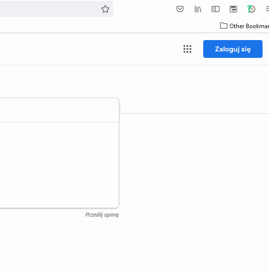
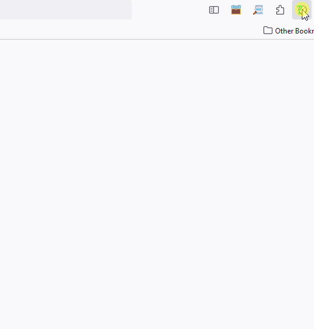

    <h1 align="center">
        
        How long I've been here?
    </h1>

    Keep the track of how much time you spent on a website

    
    
    

This project is the Mozilla Firefox extension plugin.
 It's purpose is to allow user to track, monitor the time spent on each website.

**How does it work?**

Once you visit a website (no matter if by switching the tab, or entering a URL in the current tab), the extension catches that moment and summarize the time spent on the website you are leaving.
 Please note, that this extension summarizes and shows the time spent for a website in general, not for a certain webpage.
What it means is that, for example of youtube service - this extension will calculate time spent on youtube in general, not the time spent on separate videos.

**Privacy**

This extension is to allow user to track his time, not to gather any data for statistics.
 This extension does not sends any data to anywhere, but saves the data locally on your machine so that **your data stays with you**.

---
  
## Installation & Usage ##

This extension can be installed by:
* installing it via the Mozilla add-ons market by clicking the button bellow: 
* downloading it directly from the [Releases page](https://github.com/BartoszKlonowski/how-long-ive-been-here/releases) and install it manually in your browser

After successful installation you will see the extension icon in the upper-right corner of your browser.
Popup that appears contains two views:
| | | |
|:-:|:-|:-:|
| **Basic** | Initial view that displays the overall time spent on the currently active website. |  |
| **Extended** | Available after pressing the "More" button. Contains the list of all visited websites and the overall time spent on each of them. |  |

---

## Contributing ##

If you would like to contribute to the *How Long I've Been Here* project, you are more than welcome!
 Any contribution is to make the project better and to improve the user's experience.
 So if you'd like to contribute, you can do this in one of the following ways:

* Create an [Issue](https://github.com/BartoszKlonowski/how-long-ive-been-here/issues/new) and let the author handle it
 Each issue created in the [Issues](https://github.com/BartoszKlonowski/how-long-ive-been-here/issues) section gives a chance of improving the project and make it even more useful.
* Create the [Pull Request](https://github.com/BartoszKlonowski/how-long-ive-been-here/compare) with the desired changes (please see further for how to develop this extension).

---

## Development ##

If you plan to implement changes to this extension:

1. Clone your fork of this repository
2. Run `npm install` in the root of this repository to install all the dependencies and tools Please make sure to have the `npm` installed first.
3. Implement your changes and test them:
 Manually by following [these steps](https://extensionworkshop.com/documentation/develop/debugging/)
 Or automatically by running `npm run test` and `npm run build` in the root of your clone

---

## Thank you! ##

If you like this project, or you find it helpful, please share your opinion with the author or just give it a star!
